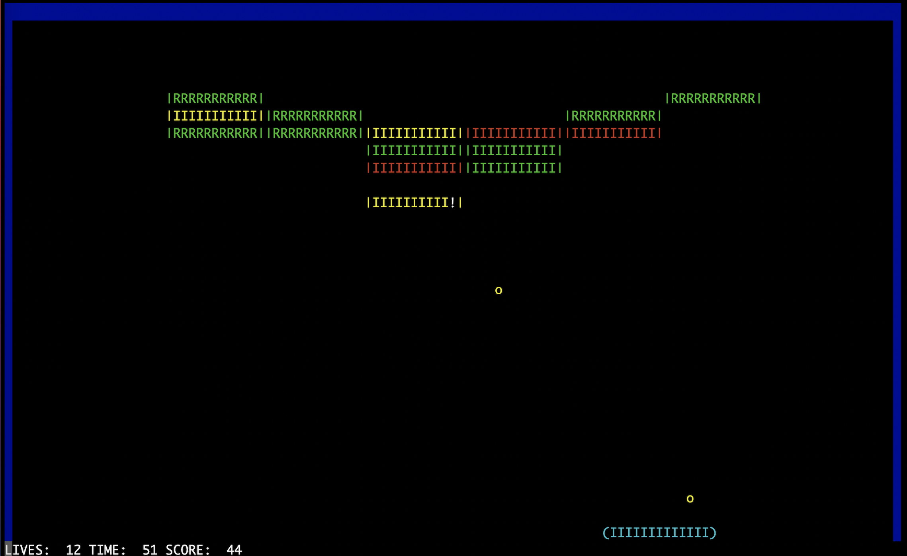

# The Brick Breaker

<i>A python built Brick Breaker game to demonstrate the OOPS concept</i>.

## Instruction to Play

```shell
$ pip3 install numpy
$ python3 play.py
```



## Features of the Game

* The game consists of a ball, paddle and multiple bricks.
* Bricks of various strenghts are present, each adding points to the score based on the strength on being broken.
* The position of the paddle decides the deviation of the ball on hitting

* Various Powerups are implemented such as: <br>
    1) Fast Ball : The speed of the ball is increased
    2) Expand Paddle: Paddle size is increased
    3) Shrink Paddle: Paddle size is decreased
    4) Ball Multiplier: The number of balls gets doubled
    5) Thru Balls: Balls stop reflecting from bricks, and strength of every ball appears to be minimum.
    6) Paddle Grab: It lets the ball stick to the paddle and relaunch after positoning.
    7) Shoot Laser: It lets the paddle shoot the bricks
    8) Fire Ball : Causes the bricks to explode on hitting by ball

- Multiple levels with increasing difficulty

- A Boss Enemy at the game finale!

- Sound Effect to make the game more interactive

## Controls

<kbd>s</kbd> - Release the ball from the paddle <br>
<kbd>a</kbd> - Move the paddle to the left <br>
<kbd>d</kbd> - Move the paddle to the right <br>
<kbd>l</kbd> - Skip Level <br>
<kbd>q</kbd> - Quit the game<br>


